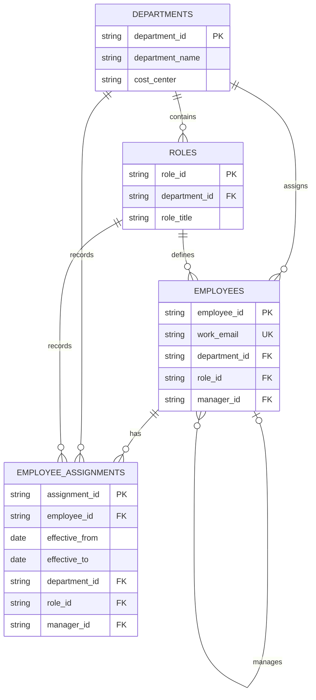

# LedgerForge — Organization ER Diagram

```mermaid
erDiagram
    DEPARTMENTS ||--o{ ROLES : contains
    DEPARTMENTS ||--o{ EMPLOYEES : assigns
    ROLES ||--o{ EMPLOYEES : defines
    EMPLOYEES o|--o{ EMPLOYEES : manages
    EMPLOYEES ||--o{ EMPLOYEE_ASSIGNMENTS : has
    DEPARTMENTS ||--o{ EMPLOYEE_ASSIGNMENTS : records
    ROLES ||--o{ EMPLOYEE_ASSIGNMENTS : records

    DEPARTMENTS {
        string department_id PK
        string department_name
        string cost_center
    }

    ROLES {
        string role_id PK
        string department_id FK
        string role_title
    }

    EMPLOYEES {
        string employee_id PK
        string work_email UK
        string department_id FK
        string role_id FK
        string manager_id FK
    }

    EMPLOYEE_ASSIGNMENTS {
        string assignment_id PK
        string employee_id FK
        date effective_from
        date effective_to
        string department_id FK
        string role_id FK
        string manager_id FK
    }
```
